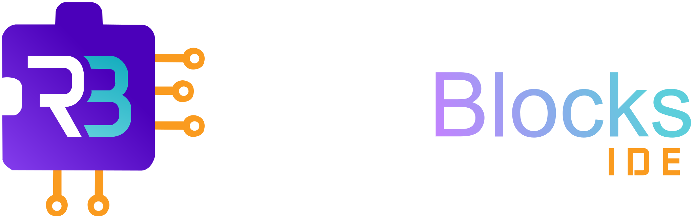

<div align="center">



# RoboBlocks IDE

**IDE de programação em blocos para Arduino — direto do navegador.**  
Feito para estudantes e iniciantes. Sem instalar nada. Sem precisar saber C++.

<br>


</div>

---

## 🧩 O que é isso?

O **RoboBlocks** é uma IDE visual baseada em blocos (tipo Scratch, mas pra Arduino) que roda no navegador. A ideia é simples: o usuário arrasta e encaixa blocos de lógica, e o sistema gera o código C++ correspondente em tempo real — sem o usuário precisar ver uma linha de código se não quiser.

Para enviar o código para a placa física via USB, a IDE se conecta a um pequeno servidor local (o **Conector**) que roda na máquina do usuário e usa o `arduino-cli` por baixo dos panos.

```
Navegador (IDE)
│
├── Blockly Workspace ──► arduinoGenerator ──► Código C++ (Monaco)
│
└── fetch() ──► Conector (agent.js : porta 3000)
                      │
                arduino-cli.exe
                      │
               Arduino via USB
```

---

## ⚡ Stack

| Camada | Tecnologia |
|---|---|
| Interface | HTML + CSS + JavaScript (vanilla) |
| Motor de blocos | Google Blockly |
| Editor de código | Monaco Editor (mesmo motor do VS Code) |
| Geração de código | Gerador Arduino customizado (extensão Blockly) |
| Conector local | Node.js + Express |
| Compilador / Upload | `arduino-cli` (binário embutido) |
| Monitor Serial | Web Serial API (Chrome / Edge) |

---

## 🚀 Funcionalidades

### Seleção de plataforma

Na tela inicial o usuário escolhe o hardware antes de entrar na IDE:

| Plataforma | Descrição |
|---|---|
| 🔵 **Arduino Uno** | Uso geral — sensores avulsos, lógica, circuitos |
| 🟣 **Arduino Mega** | Projetos maiores, mais pinos digitais e analógicos |
| 🟠 **Caixinha Educacional** | Kit do IFNMG com LEDs, botões e buzzer pré-mapeados |

A plataforma escolhida define quais categorias de blocos aparecem na Toolbox e qual placa o gerador usa.

---

### 🧱 Editor de Blocos

- Workspace com scroll, zoom e snap automático.
- **Bloco "Iniciar"** fixo e não deletável — ponto de entrada com slots `Setup` e `Loop`, espelhando a estrutura de um sketch Arduino.
- Criação de variáveis via botão `[+]` embutido no bloco Iniciar.
- Suporte a funções com e sem retorno, incluindo passagem de parâmetros.

**Categorias de blocos disponíveis:**

| Categoria | O que faz |
|---|---|
| 🔷 Lógica | Condicionais if/else, operadores booleanos |
| 🔢 Matemática | Operações aritméticas, funções numéricas |
| 💬 Texto | Concatenação, conversão de tipos |
| 📦 Variáveis | Criar, ler e atribuir variáveis |
| 🔁 Controles | Loops, repetir N vezes, delay |
| 📥 Entrada | Leitura digital/analógica, Serial read |
| 📤 Saída | Escrita digital, PWM, Serial print |
| 🌡️ Sensores | LDR, sensor de linha (TCRT5000), ultrassônico |
| ⚙️ Servo | Controle de ângulo de servomotor |
| 📦 Caixinha | LEDs, botões, buzzer — pinos mapeados automaticamente |
| 🚗 Carrinho | Ponte H, mover frente/trás/esquerda/direita, parar |
| 🔧 Funções | Definir e chamar funções customizadas |

---

### 👁️ Live Code (Código em Tempo Real)

Painel lateral que exibe o C++ gerado em tempo real enquanto você edita os blocos. Usa o Monaco Editor com syntax highlighting completo. Também tem um modo de edição manual — dá pra digitar direto no editor e desacoplar da geração automática.

Botões disponíveis no painel:
- **▶ Código** — abre modal com o código final para copiar
- **⬇ .ino** — baixa o arquivo direto para a máquina

---

### 🎨 Temas

Quatro temas aplicados simultaneamente à UI, ao workspace do Blockly e ao Monaco:

| Tema | Estilo |
|---|---|
| **Aura** *(padrão)* | Dark — roxo / neon |
| **Light** | Claro — estilo GitHub |
| **Void** | Preto absoluto — alto contraste |
| **Coffee** | Dark quente — tons terrosos |

Preferência salva em `localStorage`.

---

### 🚀 Compilar e Enviar

Requer o **RoboBlocks Connector** rodando localmente (ver seção abaixo):

- **✔️ Verificar** — compila sem enviar, reporta erros de sintaxe com destaque no Monaco.
- **🚀 Enviar** — compila e faz upload para a placa na porta COM selecionada.
- Porta COM detectada automaticamente via Web Serial API.
- Modo `COM_TESTE` disponível para simular upload sem hardware conectado.
- Indicador de status do Conector na barra superior (🟢 online / ⚫ offline).

---

### 🔌 Monitor Serial

Painel de terminal integrado à IDE (botão **Monitor**):

- Usa a Web Serial API — requer **Chrome ou Edge**.
- Seleção de baud rate, auto-scroll, timestamps por mensagem.
- Envio de comandos para a placa via input de texto (Enter ou botão Enviar).

---

### 🔩 Montagem Virtual de Hardware

Painel visual para planejar as conexões físicas antes de montar na prática:

- Exibe o SVG da placa selecionada (Uno ou Mega), injetado dinamicamente.
- Adicione componentes e conecte pinos da placa aos pinos do componente com fios roteados.
- Zoom via scroll ou botões `+` / `−`, pan arrastando o fundo.
- Estado salvo e restaurado automaticamente.

> ⚠️ Em expansão — catálogo de componentes ainda pequeno (LED implementado, mais chegando).

---

## 🛠️ Como Mexe

### Pré-requisitos

- **Navegador:** Chrome ou Edge (Web Serial API é obrigatória para upload).
- **RoboBlocks Connector** rodando localmente para compilar/enviar.
- **Arduino conectado via USB** (só para upload — editar blocos funciona sem).

### Rodando o Conector

```bash
# Na pasta static/js/
npm install
node agent.js
```

O servidor sobe na porta `3000`. A URL pode ser alterada na IDE em **⚙️ Configurações → URL do Conector**.

### Fluxo básico de uso

```
1. Abrir interface/index.html no navegador
2. Escolher a plataforma (Uno, Mega ou Caixinha)
3. Arrastar blocos da Toolbox para o workspace
4. Encaixar dentro do bloco "Iniciar" (Setup ou Loop)
5. Acompanhar o código no painel Live Code
6. Selecionar porta COM → Verificar → Enviar
```

---

## 📁 Estrutura de Arquivos

```
projeto/
├── interface/
│   ├── index.html               # Ponto de entrada — abrir no navegador
│   └── stylesheet.css           # Estilos e temas
│
├── static/js/
│   ├── main.js                  # Lógica principal da IDE
│   ├── hardware_assembly.js     # Painel de montagem virtual
│   ├── virtualBoards.js         # Carregamento dinâmico dos SVGs das placas
│   ├── agent.js                 # Conector local (servidor Express — roda separado)
│   ├── package.json             # Dependências do Conector
│   │
│   └── blocks/
│       ├── blocks_definition/   # Definição visual dos blocos (Blockly JSON API)
│       │   ├── blocks_caixinha.js
│       │   ├── blocks_carrinho.js
│       │   ├── blocks_controls.js
│       │   ├── blocks_entrada.js
│       │   ├── blocks_saida.js
│       │   ├── blocks_sensores.js
│       │   ├── blocks_servo.js
│       │   └── ...
│       │
│       └── blocks_generators/arduinoGenerator/  # Bloco → código C++
│           ├── arduinoGenerator_setup.js
│           ├── generators_caixinha.js
│           ├── generators_carrinho.js
│           └── ...
│
└── src/img/
    ├── Uno.svg                  # SVG da placa Uno (injetado via JS)
    ├── Mega.svg                 # SVG da placa Mega
    ├── Caixinha.png             # Imagem do kit educacional
    └── componentes/             # SVGs dos componentes para montagem
```

---

## ➕ Como Adicionar um Novo Bloco

Dois arquivos para criar/editar, mais uma linha no toolbox:

**1. Definição visual** — `blocks_definition/blocks_[categoria].js`

```javascript
Blockly.defineBlocksWithJsonArray([
  {
    "type": "meu_bloco",
    "message0": "Fazer algo com %1",
    "args0": [{ "type": "input_value", "name": "PARAM", "check": "Number" }],
    "previousStatement": null,
    "nextStatement": null,
    "colour": "#a277ff",
    "tooltip": "Descrição curta do que o bloco faz."
  }
]);
```

**2. Gerador de código** — `blocks_generators/arduinoGenerator/generators_[categoria].js`

```javascript
arduinoGenerator.forBlock["meu_bloco"] = function(block) {
  const param = arduinoGenerator.valueToCode(block, "PARAM", arduinoGenerator.ORDER_NONE) || "0";
  return `minhaFuncao(${param});\n`;
};
```

**3. Registrar na Toolbox** — dentro do `<toolbox>` no `index.html`

```xml
<block type="meu_bloco"></block>
```

---

## 🔗 API do Conector

O frontend se comunica com o Conector via HTTP em `http://localhost:3000`:

| Endpoint | Método | Payload | Descrição |
|---|---|---|---|
| `/status` | `GET` | — | Verifica se o Conector está online |
| `/verify` | `POST` | `{ code, board }` | Compila sem fazer upload |
| `/upload` | `POST` | `{ code, board, port }` | Compila e envia para a placa |

`board` aceita: `"uno"` · `"mega"` · `"nano"` — porta `"COM_TESTE"` ativa modo simulação.

---

## 📊 Status do Desenvolvimento

> Este documento é um retrato do estado atual do projeto — não uma especificação final. Muita coisa ainda vai mudar.

### ✅ Funcionando hoje

- Fluxo completo: blocos → código → upload via Conector
- Todas as categorias de blocos listadas acima
- Temas visuais + persistência de sessão
- Monitor Serial Web
- Painel de montagem virtual (funcional, em expansão)
- Suporte a Uno, Mega e Caixinha Educacional

### 🚧 Em andamento / incompleto

- **Montagem virtual** — catálogo de componentes ainda pequeno (só LED por enquanto)
- **Caixinha** — mapeamento de pinos hardcoded nos blocos, pode precisar de revisão
- **Conector** — Windows-only por enquanto (`arduino-cli.exe`). Linux/macOS não suportados ainda
- **Testes automatizados** — ausentes, tudo é manual por enquanto

### ⚠️ Pontos de atenção para devs

- `main.js` está monolítico (~1.000 linhas) — refatoração em módulos vai ser necessária
- O gerador usa `float` como tipo padrão para variáveis em funções; projetos que precisem de `int` ou `String` vão precisar de ajuste
- O autosave usa `localStorage` (limite ~5MB, pode ser limpo pelo browser) — para projetos grandes, recomendado exportar o `.xml` manualmente

---

<div align="center">

Feito com 🟣 no IFNMG — Campus Montes Claros

</div>
