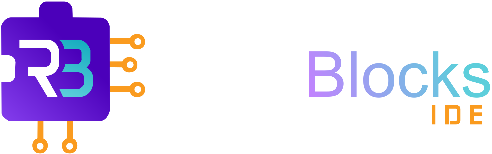

<div align="center">



# RoboBlocks IDE

**IDE de programação em blocos para Arduino — direto do navegador.**
Feito para estudantes e iniciantes. Sem instalar nada. Sem precisar saber C++.

<br>


</div>

---

## 🧩 O que é isso?

O **RoboBlocks** é uma IDE visual baseada em blocos (tipo Scratch, mas pra Arduino) que roda no navegador. A ideia é simples: o usuário arrasta e encaixa blocos de lógica, e o sistema gera o código C++ correspondente em tempo real — sem o usuário precisar ver uma linha de código se não quiser.

Para enviar o código para a placa física via USB, a IDE se conecta a um pequeno servidor local (o **Conector**) que roda na máquina do usuário e usa o `arduino-cli` por baixo dos panos, com o binário já embutido dentro do executável do Conector.

```
Navegador (IDE)
│
├── Blockly Workspace ──► arduinoGenerator ──► Código C++ (Monaco)
│
└── fetch() ──► Conector (agent.js : porta 3000)
                      │
                arduino-cli (embutido, extraído para pasta local na 1ª execução)
                      │
               Arduino via USB
```

---

## ⚡ Stack

| Camada | Tecnologia |
|---|---|
| Interface | HTML + CSS + JavaScript (vanilla) |
| Motor de blocos | Google Blockly (via CDN, `unpkg`) |
| Editor de código | Monaco Editor (mesmo motor do VS Code, via CDN) |
| Geração de código | Gerador Arduino customizado (extensão Blockly) |
| Conector local | Node.js + Express |
| Compilador / Upload | `arduino-cli` (binário embutido, empacotado com `@yao-pkg/pkg`) |
| Monitor Serial | Web Serial API (Chrome / Edge) |

---

## 🚀 Funcionalidades

### Seleção de plataforma

Ao abrir a IDE, o usuário cai numa tela de seleção (`#selector-screen`) antes de entrar no workspace:

| Plataforma | Descrição |
|---|---|
| 🔵 **Arduino Uno** | Uso geral — sensores avulsos, lógica, circuitos |
| 🟣 **Arduino Mega** | Projetos maiores, mais pinos digitais e analógicos |
| 🟠 **Caixinha Educacional** | Kit do IFNMG com LEDs, botões e buzzer pré-mapeados |

Depois de dentro da IDE, a barra superior também tem um seletor de placa (`Uno` / `Nano` / `Mega 2560`) usado na hora de compilar/enviar — independente da tela inicial.

---

### 🧱 Editor de Blocos

- Workspace com scroll, zoom e snap automático.
- **Bloco "Iniciar"** fixo e não deletável — ponto de entrada com slots `Setup` e `Loop`, espelhando a estrutura de um sketch Arduino.
- Criação de variáveis via categoria própria (`custom="VARIABLE"`) e blocos de função com e sem retorno, incluindo passagem de parâmetros (`custom="PROCEDURE"`).
- Categoria de **Exemplos** prontos direto na toolbox (botões, não blocos): Piscar LED, Controlar Servo, Ler Potenciômetro.

**Categorias reais na Toolbox hoje** (a organização é em árvore, com subcategorias):

| Categoria | Subcategorias / conteúdo |
|---|---|
| 🟠 Exemplos | Botões de projeto pronto (Blink, Servo, Potenciômetro) |
| 🔴 Lógica e Controle | Controle (delay, if/else, while, repeat, stop), Lógica (booleanos, comparação), Matemática (aritmética, módulo, constrain, random, map), Texto (concatenar, converter) |
| 🔵 Componentes | Entrada/Sensores (leitura digital/analógica, pulseIn, ultrassônico, millis), Saída/Atuadores (pinMode, digitalWrite, analogWrite/PWM, Serial print, tone/noTone), Servo Motor (escrever/ler ângulo), Display LCD (imprimir linha, limpar) |
| 🟢 Sensores Fáceis | Versões simplificadas "de um bloco só" para luz, linha, potenciômetro, distância e botão — pensadas pra quem está começando |
| 🟠 Projetos Especiais | Carrinho (motor DC genérico: frente/trás/esquerda/direita/parar), Robô CDR CAR (variante com pinos de velocidade dedicados), Caixinha (LEDs, distância, botão, luz, buzzer com nota/silenciar/sirene) |
| 🌸 Variáveis | Criação e leitura de variáveis (categoria nativa do Blockly) |
| 🟣 Funções | Definir/chamar procedimentos, com e sem retorno |

---

### 👁️ Live Code (Código em Tempo Real)

Painel lateral que exibe o C++ gerado em tempo real enquanto você edita os blocos. Usa o Monaco Editor com syntax highlighting completo. Também tem um modo de edição manual — dá pra digitar direto no editor e desacoplar da geração automática (com botão para restaurar a partir dos blocos).

Botões disponíveis no painel:
- **▶ Código** — abre modal com o código final para copiar ou editar manualmente
- **🔄 Restaurar Blocos** — descarta edição manual e volta ao código gerado pelos blocos
- **⬇️ Baixar .ino** — baixa o arquivo direto para a máquina
- **📋 Copiar Código** — copia para a área de transferência

---

### 🎨 Temas

Quatro temas aplicados simultaneamente à UI, ao workspace do Blockly e ao Monaco:

| Tema | Estilo |
|---|---|
| **Aura** *(padrão)* | Dark — roxo / neon |
| **Light** | Claro — estilo GitHub |
| **Void** | Preto absoluto — alto contraste |
| **Coffee** | Dark quente — tons terrosos |

Preferência salva em `localStorage`, gerenciada por `core/theme-manager.js`.

---

### 🚀 Compilar e Enviar

Requer o **RoboBlocks Connector** rodando localmente (ver seção abaixo):

- **✔️ Verificar** — compila sem enviar, reporta erros de sintaxe/compilação vindos direto do `arduino-cli`.
- **🚀 Enviar** — compila e faz upload para a placa na porta COM selecionada.
- **🔄 Atualizar Portas** — busca as portas seriais disponíveis via endpoint `/ports` do Conector.
- Modo `COM_TESTE` disponível na lista de portas para simular verificação/upload sem hardware conectado (respostas falsas com delay, sem tocar o `arduino-cli`).
- Indicador de status do Conector na barra superior (`agentStatus` / `agentDot` — 🟢 online / ⚫ offline), gerenciado por `connector/connector-status.js`.
- Configurações (`⚙️`) permitem apontar para um `arduino-cli` próprio (avançado) e mudar o endereço do Conector (padrão `http://localhost:3000`).

---

### 🔌 Monitor Serial

Painel de terminal integrado à IDE (botão **🔌 Monitor**), implementado em `serial/serial-monitor.js`:

- Usa a Web Serial API — requer **Chrome ou Edge**.
- Seleção de baud rate, auto-scroll, timestamps por mensagem.
- Envio de comandos para a placa via input de texto (Enter ou botão Enviar).

---

### 🔩 Montagem Virtual de Hardware

Painel visual (`hardware_assembly.js`) para planejar as conexões físicas antes de montar na prática:

- Exibe o SVG da placa selecionada (Uno ou Mega), injetado dinamicamente via `virtualBoards.js`.
- Botões para adicionar componentes: **LED**, **Botão**, **Potenciômetro**, **LDR**, **Ultrassom**, **Servo** e **Ponte H**.
- Conecte pinos da placa aos pinos do componente com fios roteados (desenhados em `<svg id="wire-canvas">`).
- Zoom via scroll ou botões `+` / `−` / centralizar, pan arrastando o fundo.
- Botão de **Iniciar Simulação** na barra da montagem (`toggleSimulacao`).
- Estado salvo e restaurado automaticamente.

> ⚠️ **Catálogo de SVGs incompleto:** o código já reconhece os 7 tipos de componente acima, mas em `src/img/componentes/` só existe o arquivo `led.svg` hoje. Botão, potenciômetro, LDR, servo, ultrassom e a ponte H (`l298n.svg`) ainda vão buscar um arquivo que não existe — precisa desenhar/adicionar esses SVGs para a montagem virtual funcionar com todos os componentes que os botões já oferecem.

---

## 🛠️ Como Mexe

### Pré-requisitos

- **Navegador:** Chrome ou Edge (Web Serial API é obrigatória para upload e monitor serial).
- **RoboBlocks Connector** rodando localmente para compilar/enviar.
- **Arduino conectado via USB** (só para upload — editar blocos funciona sem).

### Rodando o Conector

```bash
# Na pasta static/js/
npm install
node agent.js
```

O servidor sobe na porta `3000`. Na primeira execução ele extrai o `arduino-cli` embutido para uma pasta persistente do sistema (`%LOCALAPPDATA%/RoboBlocks/bin` no Windows) e instala automaticamente o core `arduino:avr` e a biblioteca `Servo`. A URL pode ser alterada na IDE em **⚙️ Configurações → Endereço do Agente**.

Para gerar o executável distribuível do Conector:

```bash
npm run build
# gera RoboBlocksConnector.exe via @yao-pkg/pkg (--sea)
```

> O `.exe` gerado não é versionado no repositório (passa de 100MB) — é distribuído via GitHub Releases.

### Fluxo básico de uso

```
1. Abrir interface/index.html no navegador
2. Escolher a plataforma (Uno, Mega ou Caixinha)
3. Arrastar blocos da Toolbox para o workspace
4. Encaixar dentro do bloco "Iniciar" (Setup ou Loop)
5. Acompanhar o código no painel Live Code
6. Selecionar placa e porta COM → Verificar → Enviar
```

---

## 📁 Estrutura de Arquivos

```
projeto/
├── interface/
│   ├── index.html                    # Ponto de entrada — abrir no navegador
│   └── stylesheet.css                # Estilos e temas
│
├── static/js/
│   ├── main.js                       # Ponto de entrada final (bootstrap — os módulos abaixo já fizeram o trabalho pesado)
│   ├── hardware_assembly.js          # Painel de montagem virtual
│   ├── virtualBoards.js              # Carregamento dinâmico dos SVGs das placas
│   ├── agent.js                      # Conector local (servidor Express — roda separado)
│   ├── package.json                  # Dependências e build do Conector
│   │
│   ├── core/                         # Núcleo da IDE
│   │   ├── workspace-init.js         # Cria o workspace Blockly, restaura autosave/exemplo padrão
│   │   ├── autosave.js               # Salva o workspace em localStorage
│   │   ├── theme-manager.js          # Aplica e persiste o tema visual
│   │   ├── trashcan-behavior.js      # Comportamento da lixeira do Blockly
│   │   └── var-button-bindings.js    # Bindings do botão de criar variável
│   │
│   ├── ui/                           # Interações de UI
│   │   ├── ui-menu.js
│   │   ├── ui-modals.js
│   │   ├── ui-responsive.js
│   │   └── ui-variable-prompt.js
│   │
│   ├── editor/
│   │   └── monaco-integration.js     # Integração do Monaco Editor (Live Code)
│   │
│   ├── connector/                    # Comunicação com o Conector local
│   │   ├── connector-status.js       # Ping de status (online/offline)
│   │   └── connector-upload.js       # Verificar/Enviar via /verify e /upload
│   │
│   ├── project/
│   │   └── project-io.js             # Salvar/carregar .xml, exemplos prontos, apagar tudo
│   │
│   ├── serial/
│   │   └── serial-monitor.js         # Monitor serial via Web Serial API
│   │
│   ├── RoboBlocks_Conector/
│   │   └── arduino-cli.exe           # Binário embutido no build do Conector
│   │
│   └── blocks/
│       ├── blocks_definition/        # Definição visual dos blocos (Blockly JSON API)
│       │   ├── blocks_caixinha.js
│       │   ├── blocks_carrinho.js
│       │   ├── blocks_controls.js
│       │   ├── blocks_default.js
│       │   ├── blocks_entrada.js
│       │   ├── blocks_logic.js
│       │   ├── blocks_math.js
│       │   ├── blocks_saida.js
│       │   ├── blocks_sensores.js
│       │   ├── blocks_servo.js
│       │   ├── blocks_text.js
│       │   └── blocks_variables.js
│       │
│       └── blocks_generators/arduinoGenerator/  # Bloco → código C++
│           ├── arduinoGenerator_setup.js
│           ├── generators_caixinha.js
│           ├── generators_carrinho.js
│           ├── generators_controls.js
│           ├── generators_default.js
│           ├── generators_entrada.js
│           ├── generators_logic.js
│           ├── generators_math.js
│           ├── generators_procedures.js
│           ├── generators_saida.js
│           ├── generators_sensores.js
│           ├── generators_servo.js
│           ├── generators_text.js
│           └── generators_variables.js
│
└── src/img/
    ├── Uno.svg                       # SVG da placa Uno (injetado via JS)
    ├── Mega.svg                      # SVG da placa Mega
    ├── Caixinha.png                  # Imagem do kit educacional
    ├── Logo.svg                      # Logo do RoboBlocks
    └── componentes/
        └── led.svg                   # Único componente com SVG pronto pra montagem virtual hoje
```

---

## ➕ Como Adicionar um Novo Bloco

Dois arquivos para criar/editar, mais uma linha no toolbox:

**1. Definição visual** — `blocks_definition/blocks_[categoria].js`

```javascript
Blockly.defineBlocksWithJsonArray([
  {
    "type": "meu_bloco",
    "message0": "Fazer algo com %1",
    "args0": [{ "type": "input_value", "name": "PARAM", "check": "Number" }],
    "previousStatement": null,
    "nextStatement": null,
    "colour": "#a277ff",
    "tooltip": "Descrição curta do que o bloco faz."
  }
]);
```

**2. Gerador de código** — `blocks_generators/arduinoGenerator/generators_[categoria].js`

```javascript
arduinoGenerator.forBlock["meu_bloco"] = function(block) {
  const param = arduinoGenerator.valueToCode(block, "PARAM", arduinoGenerator.ORDER_NONE) || "0";
  return `minhaFuncao(${param});\n`;
};
```

**3. Registrar na Toolbox** — dentro do `<xml id="toolbox">` no `index.html`, na categoria certa

```xml
<block type="meu_bloco"></block>
```

---

## 🔗 API do Conector

O frontend se comunica com o Conector via HTTP em `http://localhost:3000`:

| Endpoint | Método | Payload | Descrição |
|---|---|---|---|
| `/status` | `GET` | — | Verifica se o Conector está online, retorna engine e versão |
| `/ports` | `GET` | `?arduinoPath` (opcional) | Lista portas seriais detectadas + porta de simulação `COM_TESTE` |
| `/verify` | `POST` | `{ code, board, arduinoPath }` | Compila sem fazer upload |
| `/upload` | `POST` | `{ code, board, port, arduinoPath }` | Compila e envia para a placa |

`board` aceita: `"uno"` · `"mega"` · `"nano"` (mapeados para os FQBNs `arduino:avr:*`) — porta `"COM_TESTE"` ativa modo simulação (respostas falsas com delay, sem chamar o `arduino-cli`).

`arduinoPath` é opcional: se omitido ou igual ao valor padrão, o Conector usa automaticamente o `arduino-cli` embutido (extraído para uma pasta persistente na primeira execução); só é necessário informar um caminho absoluto se o usuário tiver uma instalação própria.

---

## 📊 Status do Desenvolvimento

> Este documento é um retrato do estado atual do projeto — não uma especificação final. Muita coisa ainda vai mudar.

### ✅ Funcionando hoje

- Fluxo completo: blocos → código → upload via Conector, com detecção automática de portas
- Todas as categorias de blocos listadas acima, incluindo variantes de "Sensores Fáceis" simplificados para iniciantes
- Live Code com edição manual desacoplável e restauração para os blocos
- Temas visuais (4 opções) + persistência de sessão via `localStorage`
- Monitor Serial Web completo (baud rate, timestamps, envio de comandos)
- Painel de montagem virtual funcional (fios, zoom, pan, simulação básica)
- Suporte a Uno, Mega, Nano (compilação) e Caixinha Educacional
- Conector com extração automática do `arduino-cli` embutido + instalação automática do core `arduino:avr` e da lib `Servo` na primeira execução

### 🚧 Em andamento / incompleto

- **Montagem virtual** — código já reconhece 7 componentes (LED, Botão, Potenciômetro, LDR, Ultrassom, Servo, Ponte H), mas só o SVG do LED existe em `src/img/componentes/`; os outros 6 componentes vão dar erro ao buscar o próprio desenho
- **Caixinha** — mapeamento de pinos hardcoded nos blocos, pode precisar de revisão se o kit físico mudar de revisão
- **Conector** — Windows-only por enquanto (`arduino-cli.exe`, build via `pkg --sea` mira Windows). Linux/macOS não suportados ainda
- **Testes automatizados** — ausentes, tudo é manual por enquanto
- **Persistência de projeto** — depende de `localStorage` (~5MB, pode ser limpo pelo navegador) e export/import manual de `.xml`; não há conta de usuário nem salvamento em nuvem

### ⚠️ Pontos de atenção para devs

- `main.js` já não é mais o arquivo monolítico de antes — virou só o ponto de entrada final; a lógica está distribuída em `core/`, `ui/`, `editor/`, `connector/`, `project/` e `serial/`. Ao mexer em algo, procure primeiro o módulo temático certo antes de assumir que está tudo em `main.js`
- O gerador usa `float` como tipo padrão para variáveis em funções; projetos que precisem de `int` ou `String` vão precisar de ajuste
- O autosave usa `localStorage` (limite ~5MB, pode ser limpo pelo browser) — para projetos grandes, recomendado exportar o `.xml` manualmente
- O `.exe` do Conector não é commitado (ultrapassa o limite de 100MB do GitHub) — é distribuído via GitHub Releases; só o `arduino-cli.exe` de entrada (usado para embutir no build) fica versionado

---

<div align="center">

Feito com 🟣 no IFNMG — Campus Montes Claros

</div>
